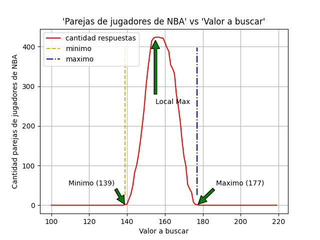
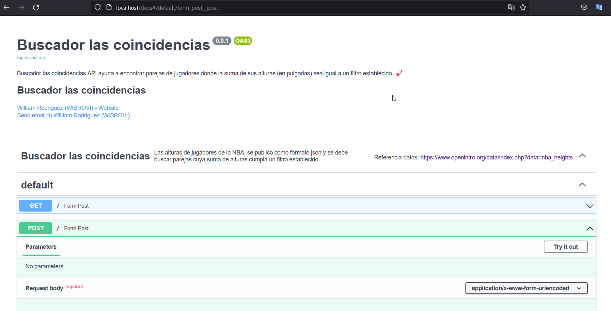

# **Tabla de Contenido**
- [1. Proyecto](#1.-Proyecto)
- [2. Preparar el entorno para ejecutar la solución](#2.-Preparar-el-entorno-para-ejecutar-la-solución)
  - [2.1. Maquina virtual](#2.1.-Maquina-virtual)
    - [2.1.1. Linux](#2.1.1.-Linux)
    - [2.1.2. Windows](#2.1.2.-Windows)
  - [2.2. Docker](#2.2.-Docker)
- [3. Solucion](#3.-Solucion)
- [4. Ejecutar la solución](#4.-Ejecutar-la-solución)
  - [4.1. Lanzar la aplicación](#4.1.-Lanzar-la-aplicación)
  - [4.2. Probar la web](#4.2.-Probar-la-web)
- [5. Documentación swagger](#5.-Documentación-swagger)
- [6. Test Unit](#6.-Test-Unit)
- [7. Datos Autor](#Autor)


#1. Proyecto
El proyecto consiste en crear una funcion que busca los jugadores de la NBA
basado en la entrada del usuario. Los datos originalmente vienen de
[aquí](https://www.openintro.org/data/index.php?data=nba_heights). Para facilidad
de implementación, hemos servido los datos en formato json [aquí](https://mach-eight.uc.r.appspot.com/).

La tarea es crear una aplicación que solicite al usuario que ingrese una entrada
numérica. La aplicación descarga los datos del sitio web arriba mencionado
(https://mach-eight.uc.r.appspot.com) e imprime todas las parejas de jugadores
cuyas alturas en pulgadas (in), al ser sumadas, corresponden al número de entrada.
Si no se encuentran coincidencias, la aplicación imprime "No se encontraron coincidencias"

Ejemplo de salida de la siguiente manera:
```
> app 139

- Brevin Knight         Nate Robinson
- Nate Robinson         Mike Wilks
```

El algoritmo para encontrar los pares debe ser más rápido que O(n^2). Debe
funcionar correctamente en todos los casos de borde. Esta _no_ es una prueba a
libro cerrado. Lo invitamos a contactarnos con cualquier duda que tenga.


#2. Preparar el entorno para ejecutar la solución

##2.1. Maquina virtual
primeramente se debe crear una maquina virtual, ya sea con *pipeenv*, *virtualenv* u otro de su preferencia

```
pip install virtualenv
```

###2.1.1. Linux
```
virtualenv env
source ./env/bin/activate
pip install -r requirements.txt
```

###2.1.2. Windows
```
python -m venv env
env\Scripts\activate
pip install -r requirements.txt
```

```
Nota: recuerde que para salir del entorno debe ejecutar:
** deactivate **
```


##2.2. Docker
Yo de preferencia recomendaría usar un contenedor docker, 
simplemente basta con ejecutar el docker-compose adjunto en este repositorio
```
docker build -t "buscador_coincidencias:v1" .

docker-compose up -d
```


#3. Solucion
Para la solución se usaron metodos heuristicos, puntualmente:
- Ramificación y poda
- Busqueda lineal
- Divide y venceras

Con la combinación de estas tres métodos de solucion de algoritmos, se logra la solucion del algoritmo con una complejidad aproximada de **O(2n)**

Superando el algoritmo de busqueda por fuerza bruta (también adjunto en el repositorio, pero sin pruebas unitarias), cuya complejidad es O(n^2)

Otro factor a tener en cuenta es que no todos los valores den entrada darian una lista de parejas que cumpla la condicion del problema, entonces se presenta el siguiente grafico que muestra las opciones con respuesta



Valores por debajo del minimo (ver gráfica) o por encima del maximo (ver gráfica) darian como resultado el mensaje: ```No se encontraron coincidencias```


```
Nota: Este gráfico fue realizado con la instrucción (dentro de la maquina virtual):

python histograma.py
```

#4. Ejecutar la solución

##4.1. Lanzar la aplicación
Si elegiste la opción de docker en el 2.2), puedes obviar este paso
```
uvicorn main:app --host 0.0.0.0 --port 80
```
##4.2. Probar la web

Cargar la url: http://ip_server/
```
Nota: Si se esta trabajando desde el mismo ordenador donde se lanzo la aplicación, 
- ip_server = localhost
```

```
4.2.1) Entregar un parametro en el cuadro de texto
4.2.2) enviar el dato
4.2.3) Recibir la respuesta
```

#5. Documentación swagger

La solucion se generó como un aplicativo web para su fácil uso y junto a esta se genero documentación en swagger que se podra acceder desde:
```
http://ip_server/docs

Nota: Si se esta trabajando desde el mismo ordenador donde se lanzo la aplicación, 
- ip_server = localhost
```



#6. Test Unit
El Algoritmo cuenta con pruebas de test unitario, para ejecutar el test basta con ejecutar:
```
python .\test_busqueda_heuristica.py
```


La respuesta debe finalizar con:
```
----------------------------------------------------------------------
Ran 7 tests in 0.630s

OK
```

Cabe recalcar que para ejecutar este test unitario es necesario haber creado una maquina virtual cuyos pasos estan en el numeral 2.1.1) si la prueba se realizara en un equipo windows o 2.1.2) si ejecutara el test en linux.


#7. Autor:

Nombre: William Steve Rodriguez Villamizar

Email: wisrovi.rodriguez@gmail.com

movil: +57 300 438 1810

linkedin: [WISROVI](https://www.linkedin.com/in/wisrovi-rodriguez/)


